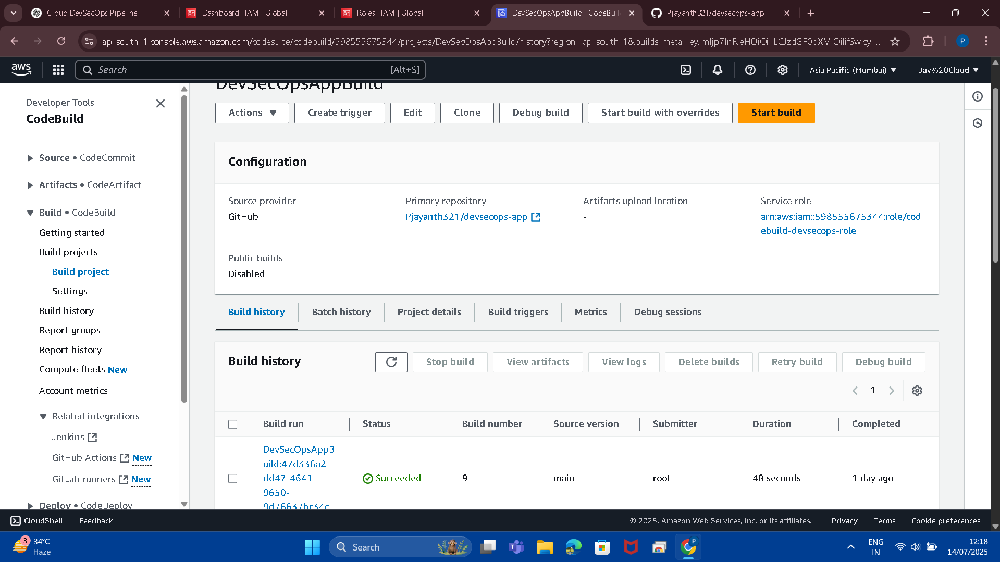
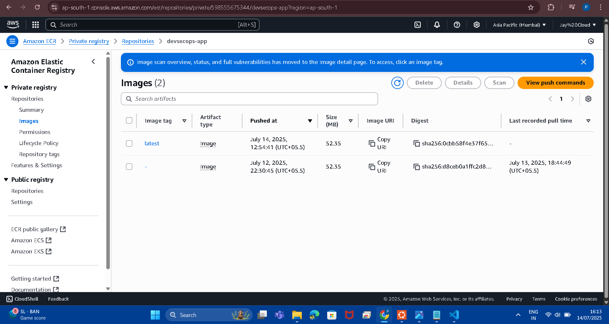
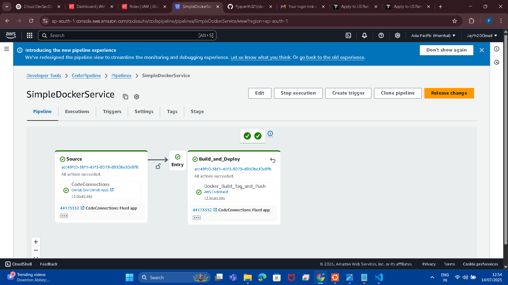

🚀 Cloud DevSecOps CI/CD Pipeline Using AWS

This project showcases a production-grade **CI/CD pipeline** using **AWS CodePipeline**, **CodeBuild**, and **Amazon ECR** to securely build and deploy a Dockerized Python application. It follows DevSecOps principles, automating every step from source to container image delivery.


📌 Project Overview

- **Language**: Python (Flask)
- **Containerization**: Docker
- **CI/CD Tools**: AWS CodePipeline & CodeBuild
- **Artifact Registry**: Amazon Elastic Container Registry (ECR)
- **Infrastructure**: Terraform
- **Security**: Trivy vulnerability scanning (optional)
- **Version Control**: GitHub


🧱 Folder Structure

```
cloud-devsecops-project/
├── app/
│   ├── app.py
│   ├── Dockerfile
│   └── buildspec.yml
├── scripts/
│   └── trivy_scan.sh
├── terraform files (*.tf)
├── screenshots/
│   ├── codebuild_project_setup.png
│   ├── codepipeline_success.png
│   └── ecr_repo_devsecops.png
└── README.md
```

---

🔄 CI/CD Pipeline Workflow

1. **GitHub Push**: Triggers CodePipeline
2. **CodeBuild Stage**:
   - Builds Docker image
   - Tags image with commit ID
   - Pushes image to Amazon ECR
3. **Completion**: On success, image is ready for deployment

---

📸 Screenshots

✅ CodeBuild: Docker Build & Push to ECR

> Confirms that the Docker image was built and successfully pushed to Amazon ECR.



---

✅ Amazon ECR: Image Registry

> Screenshot showing the Docker image successfully uploaded to ECR.



---

✅ AWS CodePipeline: CI/CD Success

> Screenshot showing full CI/CD pipeline execution with successful status.



---

✅ Highlights

- 🔹 End-to-end CI/CD pipeline using AWS native services  
- 🔹 Dockerized app automatically pushed to a secure ECR repo  
- 🔹 Terraform-managed infrastructure (IaC best practice)  
- 🔹 Resume-boosting DevSecOps project with real AWS implementation  

📈 Outcome

This project demonstrates your ability to:
- Build and deploy applications using CI/CD principles
- Automate workflows with AWS services
- Structure secure and scalable pipelines for container-based apps